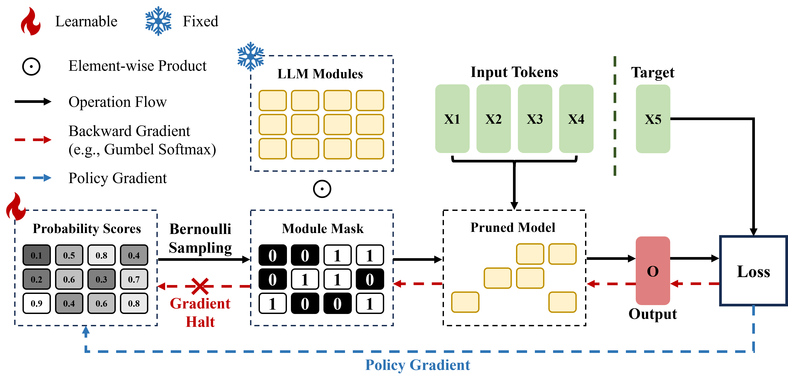
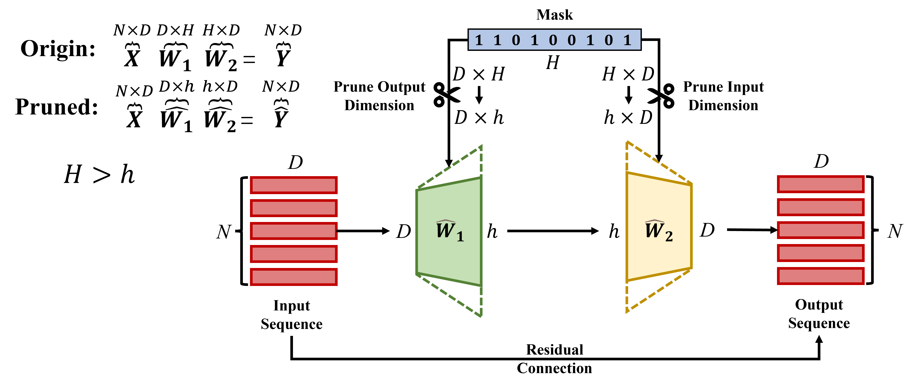

<div align="center">
<h1><a href="https://arxiv.org/abs/2406.10576">Bypass Back-propagation: Optimization-based Structural Pruning for Large Language Models via Policy Gradient</a></h1>

<p>Yuan Gao, Zujing Liu, Weizhong Zhang, Bo Du, Gui-Song Xia</p>
<!-- <p>Wuhan University</p> -->

<h3>On the <em>Efficient</em> Structural Pruning of Large Language Models via Policy Gradient<h3>
</div>

<p align="center">
    
<!--  <br> -->
</p>

## Introduction
An **efficient**, post-training structural pruning approach of Large-Language Models through a **policy gradient-based optimization** that requires **only forward passes** without back-propagation.

## Quick Start

### Installation
```
pip install -r requirement.txt
pip install git+https://github.com/EleutherAI/lm-evaluation-harness.git@v0.4.5
```

### Minimal Example
```
bash scripts/llama_2_7b.sh
```

This script will prune llama-2-7b model with sparsity (`s`) of 30%, 40%, 50%, corresponding the `rates=("0.7" "0.60" "0.50")` (`1-s`) in the script. If needed, modify the dataset path in `datautils` folder. Each experiment has an independent directory, with `prune_info.pt` saved, which is critical for model pruning. More details can be found in `pgpruning.py`.

### Evaluate Pruned Model
```
python prune_channel/eval.py \
    --exp-dir <pruned_model_path> \
    --max-seq-length 128 \
    --global-hard-mask \
    --batch-size 8
```

Specifically, `<pruned_model_path>` is the directory where the `prune_info` saved.


## Citation
If you find this project useful, please cite
```
@inproceedings{gao2025bypass,
  title={Bypass Back-propagation: Optimization-based Structural Pruning for Large Language Models via Policy Gradient},
  author={Gao, Yuan and Liu, Zujing and Zhang, Weizhong and Du, Bo and Xia, Gui-Song},
  booktitle={ACL},
  year={2025},
}
```
